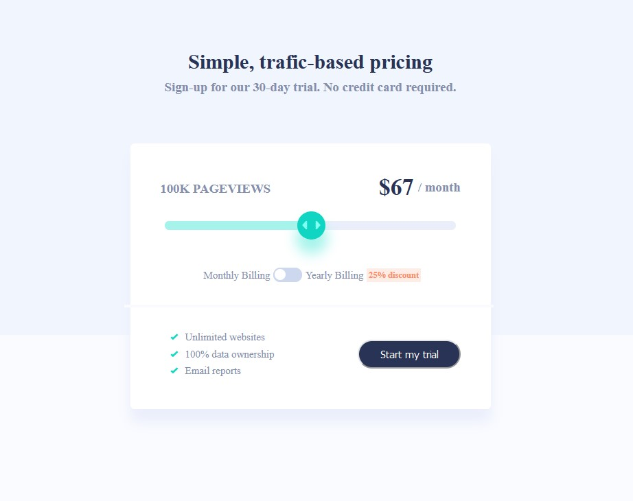

# Frontend Mentor - NFT preview card component solution

This is a solution to the [Interactive pricing component challenge on Frontend Mentor](https://www.frontendmentor.io/challenges/interactive-pricing-component-t0m8PIyY8). Frontend Mentor challenges help you improve your coding skills by building realistic projects. 

## Table of contents

- [Overview](#overview)
  - [Screenshot](#screenshot)
  - [Links](#links)
- [My process](#my-process)
  - [Built with](#built-with)
  - [Useful resources](#useful-resources)
- [Author](#author)

## Overview
This challenge is an Junior level challenge in Frontend Mentor. It is an interactive pricing component on monthy and yearly plans. The styling is with pure CSS no librabries or frameworks.

### Screenshot

### Links

- Solution URL: [Solution URL](https://github.com/Saicharan0662/frontend-mentor-solutions/tree/master/interactive-pricing-component-main)
- Live Site URL: [Live site](https://peppy-griffin-0238e6.netlify.app/)

## My process
- I started by looking at the challenge and the instructions.
- I initialize the project with create-react-app.
- Did some refining, and started making components.

### Built with

- react.js
- Semantic HTML5 markup
- CSS3
- Flexbox
- CSS pseudo-elements
- media queries

## Author

- Website - [Sai Charan](https://saicharan006.netlify.app/)
- Frontend Mentor - [@Saicharan0662](https://www.frontendmentor.io/profile/Saicharan0662)
