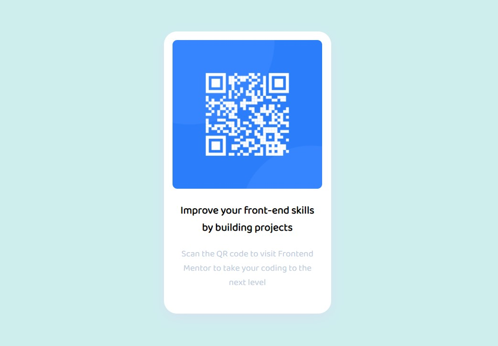

# Frontend Mentor - QR code component solution

This is a solution to the [QR code component challenge on Frontend Mentor](https://www.frontendmentor.io/challenges/qr-code-component-iux_sIO_H). Frontend Mentor challenges help you improve your coding skills by building realistic projects. 

## Table of contents

- [Overview](#overview)
  - [Screenshot](#screenshot)
  - [Links](#links)
- [My process](#my-process)
  - [Built with](#built-with)
  - [Useful resources](#useful-resources)
- [Author](#author)

## Overview
This challenge is an newbie challenge in Frontend Mentor. It is a simple QR code UI made using HTML and CSS.

### Screenshot

### Links

- Solution URL: [Solution URL](https://github.com/Saicharan0662/frontend-mentor-solutions/tree/master/qr-code-component-main)
- Live Site URL: [Live site](https://peppy-griffin-0238e6.netlify.app/)

## My process
- I started by looking at the challenge and the instructions.
- Then made a skeleton using HTML.
- Then I started to add CSS.

### Built with

- Semantic HTML5 markup
- CSS3
- Flexbox

### Useful resources

- [Resource for box-shadow](https://getcssscan.com/css-box-shadow-examples) - This helped me for getting the box-shadow. I really liked this pattern and will use it going forward.

## Author

- Website - [Sai Charan](https://saicharan006.netlify.app/)
- Frontend Mentor - [@Saicharan0662](https://www.frontendmentor.io/profile/Saicharan0662)
